# 🔐 Guía del Sistema RBAC

Sistema de control de acceso basado en roles (RBAC) completo para tu API REST.

## 📋 Tabla de Contenidos

1. [Conceptos](#conceptos)
2. [Estructura de la Base de Datos](#estructura)
3. [Roles Predefinidos](#roles)
4. [Permisos](#permisos)
5. [Uso de la API](#uso)
6. [Ejemplos](#ejemplos)

---

## 🎯 Conceptos

### ¿Qué es RBAC?

**RBAC** (Role-Based Access Control) es un sistema que controla el acceso a recursos basándose en los roles de los usuarios.

### Componentes Principales

1. **Roles**: Grupos de permisos (ej: superadmin, admin, user, guest)
2. **Permisos**: Acciones específicas sobre módulos (ej: users:create, roles:read)
3. **Usuarios**: Tienen UN rol asignado
4. **Módulos**: Secciones de la aplicación (users, roles, permissions, etc.)

---

## 🗄️ Estructura

### Tablas Creadas

```sql
roles
├── id
├── name (único)
├── description
└── created_at

permissions
├── id
├── module (users, roles, permissions, etc.)
├── action (create, read, update, delete)
├── description
└── created_at

role_permissions (Many-to-Many)
├── role_id
└── permission_id

users
├── id
├── email
├── password
├── name
├── role_id (FK a roles)
├── created_at
└── updated_at
```

---

## 👥 Roles Predefinidos

### 1. superadmin
- **Descripción**: Super administrador con todos los permisos
- **Permisos**: TODOS (15 permisos)
- **Puede**:
  - Crear, editar y eliminar roles
  - Asignar/revocar permisos
  - Gestionar usuarios
  - TODO en el sistema

### 2. admin
- **Descripción**: Administrador con permisos limitados
- **Permisos**: 6 permisos
- **Puede**:
  - CRUD completo en usuarios
  - Leer roles y permisos (no modificar)

### 3. user
- **Descripción**: Usuario registrado estándar
- **Permisos**: 2 permisos
- **Puede**:
  - Leer usuarios
  - Actualizar su propio perfil

### 4. guest
- **Descripción**: Usuario público sin autenticación
- **Permisos**: 1 permiso
- **Puede**:
  - Leer información pública de usuarios

---

## 🔑 Permisos

### Módulos y Acciones

#### `users`
- `create` - Crear usuarios
- `read` - Leer usuarios
- `update` - Actualizar usuarios
- `delete` - Eliminar usuarios

#### `roles`
- `create` - Crear roles
- `read` - Leer roles
- `update` - Actualizar roles
- `delete` - Eliminar roles

#### `permissions`
- `create` - Crear permisos
- `read` - Leer permisos
- `update` - Actualizar permisos
- `delete` - Eliminar permisos

#### `role_permissions`
- `assign` - Asignar permisos a roles
- `revoke` - Revocar permisos de roles
- `read` - Ver permisos de roles

---

## 🚀 Uso de la API

### Middlewares Disponibles

#### 1. `requirePermission(module, action)`
Verifica que el usuario tenga un permiso específico.

```typescript
// Ejemplo: Solo usuarios con permiso "users:create"
router.post("/users", requirePermission("users", "create"), createUser);
```

#### 2. `requireSuperAdmin()`
Solo permite acceso a superadmin o usuario ID=1.

```typescript
// Ejemplo: Solo superadmin puede crear roles
router.post("/roles", requireSuperAdmin(), createRole);
```

#### 3. `allowPublic(module, action)`
Permite acceso público (guest) o usuarios autenticados con permiso.

```typescript
// Ejemplo: Lectura pública de usuarios
router.get("/users", allowPublic("users", "read"), getUsers);
```

### Endpoints RBAC

#### Roles

```http
GET    /api/roles                    # Listar roles
GET    /api/roles/:id                # Ver un rol
POST   /api/roles                    # Crear rol (superadmin)
PUT    /api/roles/:id                # Actualizar rol (superadmin)
DELETE /api/roles/:id                # Eliminar rol (superadmin)
GET    /api/roles/:id/permissions    # Ver permisos del rol
POST   /api/roles/:id/permissions    # Asignar permisos (superadmin)
```

#### Permisos

```http
GET    /api/permissions              # Listar permisos
GET    /api/permissions/:id          # Ver un permiso
GET    /api/permissions/module/:mod  # Permisos de un módulo
POST   /api/permissions              # Crear permiso (superadmin)
PUT    /api/permissions/:id          # Actualizar permiso (superadmin)
DELETE /api/permissions/:id          # Eliminar permiso (superadmin)
```

---

## 💡 Ejemplos

### 1. Login como Superadmin

```bash
curl -X POST http://localhost:8000/api/auth/login \
  -H "Content-Type: application/json" \
  -d '{
    "email": "admin@example.com",
    "password": "password123"
  }'
```

**Respuesta**:
```json
{
  "success": true,
  "data": {
    "user": {
      "id": 1,
      "email": "admin@example.com",
      "name": "Admin Updated",
      "role": {
        "id": 1,
        "name": "superadmin",
        "description": "Super administrador con todos los permisos"
      }
    },
    "token": "eyJhbGc..."
  }
}
```

### 2. Crear un Nuevo Rol

```bash
TOKEN="tu-token-superadmin"

curl -X POST http://localhost:8000/api/roles \
  -H "Authorization: Bearer $TOKEN" \
  -H "Content-Type: application/json" \
  -d '{
    "name": "moderator",
    "description": "Moderador de contenido"
  }'
```

### 3. Asignar Permisos a un Rol

```bash
# Obtener IDs de permisos
curl http://localhost:8000/api/permissions \
  -H "Authorization: Bearer $TOKEN"

# Asignar permisos al rol
curl -X POST http://localhost:8000/api/roles/5/permissions \
  -H "Authorization: Bearer $TOKEN" \
  -H "Content-Type: application/json" \
  -d '{
    "permissionIds": [2, 3]
  }'
```

### 4. Registrar Usuario con Rol Automático

```bash
curl -X POST http://localhost:8000/api/auth/register \
  -H "Content-Type: application/json" \
  -d '{
    "email": "newuser@example.com",
    "password": "SecurePass123",
    "name": "New User"
  }'
```

El usuario automáticamente recibe rol `user`.

### 5. Verificar Permisos de un Usuario

```bash
curl http://localhost:8000/api/users/1 \
  -H "Authorization: Bearer $TOKEN"
```

**Respuesta** incluye el rol:
```json
{
  "success": true,
  "data": {
    "id": 1,
    "email": "admin@example.com",
    "role": {
      "id": 1,
      "name": "superadmin"
    }
  }
}
```

---

## 🛡️ Reglas Especiales

### Usuario ID=1
- Siempre tiene permisos de superadmin
- No puede ser eliminado
- Bypass de verificación de permisos

### Roles del Sistema
Los siguientes roles NO pueden ser eliminados:
- `superadmin`
- `admin`
- `user`
- `guest`

---

## 🔄 Flujo de Verificación

```mermaid
graph TD
    A[Request] --> B{Token válido?}
    B -->|No| C[401 No autorizado]
    B -->|Sí| D{Es usuario ID=1?}
    D -->|Sí| E[✓ Acceso permitido]
    D -->|No| F{Tiene rol superadmin?}
    F -->|Sí| E
    F -->|No| G{Tiene permiso específico?}
    G -->|Sí| E
    G -->|No| H[403 Prohibido]
```



---

## 📝 Notas Importantes

1. **Nuevos usuarios** reciben automáticamente rol `user`
2. **Permisos en cascada**: Al eliminar un rol, se eliminan sus asignaciones
3. **Validación estricta**: Zod valida todos los inputs
4. **Type-safe**: TypeScript garantiza tipos correctos en toda la app
5. **Acceso público**: Usa `allowPublic()` para endpoints sin auth

---

## 🚀 Próximos Pasos

1. Crear más módulos según necesidades (posts, comments, etc.)
2. Agregar permisos granulares (own_only, team_only, etc.)
3. Implementar audit log de cambios de permisos
4. Agregar UI para gestión visual de roles

---

## 🆘 Troubleshooting

### Error: "No tienes permiso para realizar esta acción"
- Verificar que el usuario tenga el rol correcto
- Verificar que el rol tenga el permiso asignado
- Revisar si el módulo y acción son correctos

### Error: "Solo superadmin puede realizar esta acción"
- Solo usuario ID=1 o rol superadmin pueden ejecutar esta acción
- Asignar rol superadmin si es necesario

### ¿Cómo cambiar el rol de un usuario?
```sql
UPDATE users SET role_id = (SELECT id FROM roles WHERE name = 'admin') WHERE id = 2;
```

---

¡Sistema RBAC implementado exitosamente! 🎉
